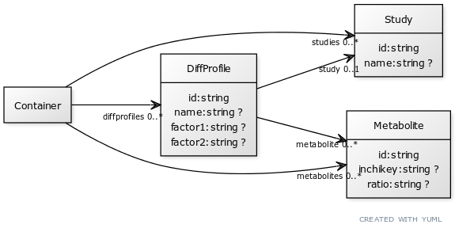

# integmet-linkml

## setup
```
pip install linkml
git clone https://github.com/integMET/integMET-LinkML
```

## Validate integMET linkml schema + data yaml
```
linkml-validate -s integmet.yaml data.yaml
```

## Generate json-schema from integMET schema yaml
```
gen-json-schema integmet.yaml
```

## Gen UML
```
gen-yuml -f png -d . integmet.yaml
```



## Convert integMET linkml schema + data to ttl
```
linkml-convert -s integmet.yaml data.yaml -o data.ttl
```

## Convert integMET linkml schema + data to json-ld

```
linkml-convert -s integmet.yaml -t json-ld data.yaml > data.jsonld
```